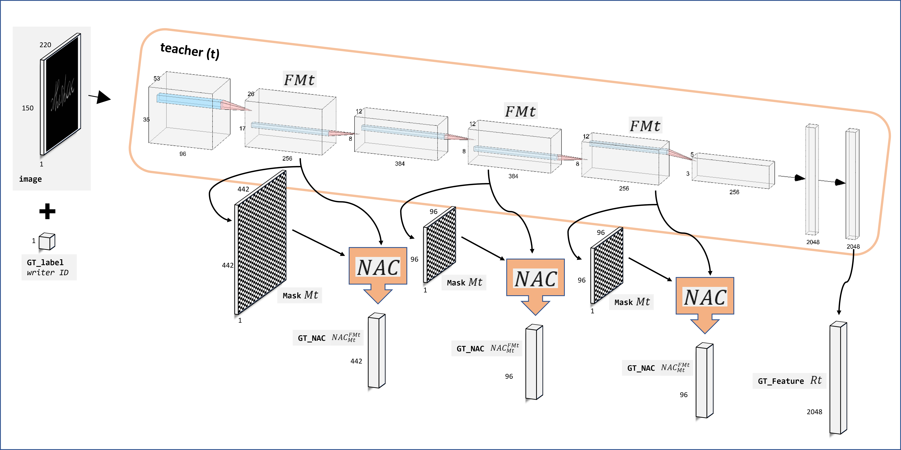

# Feature-based Knowledge Distillation (FKD)

This repository contains code to train Convolutional Neural Networks (CNNs) using a Feature-based Knowledge Distillation (FKD) method. FKD is a method for guiding the activations at the intermediate layers of a CNN during training through a Student-Teacher (S-T) scheme.  The proposed FKD method combines local activation features from intermediate layers and final extracted features, utilizing graph-based similarity between local activation features and cross-entropy or cross-correlation between global extracted features to supervise student training.

The code in this repository specifically focuses on the Offline Signature Verification (OffSV) problem, and contains code to implement the S-T training for feature extraction for Offline Handwritten Signatures, as well as code to train Writer-Dependent (WD) classifiers.

In this work,the training in a S-T configuration is realized using text data that work as information carrier to transfer the knowledge from the teacher into the student. The images of handwritten text are utilized because they possess a similar structure to signatures and most importantly, there is an abundance of data available from public sources. The text data are processed according to the procedure proposed by Tsourounis et al. in [1] to generate text images that resemble the distributions of signature images and use them as the training data of a CNN that solves a writer identification problem. The initial raw text data come from the publicly available CVL-database, where 310 writers fill in 5-10 lines of predefined text on page-forms [2].

The WD classifiers' stage originates from https://github.com/luizgh/sigver, which is the implementation of the SigNet approach described in [3]. Some modifications are made to process ONNX CNN models. 

[1] Tsourounis, Dimitrios, Ilias Theodorakopoulos, Elias N. Zois, and George Economou. "From text to signatures: Knowledge transfer for efficient deep feature learning in offline signature verification." https://doi.org/10.1016/j.eswa.2021.116136 

[2] Kleber, Florian, Stefan Fiel, Markus Diem, and Robert Sablatnig. "Cvl-database: An off-line database for writer retrieval, writer identification and word spotting." https://doi.org/10.1109/ICDAR.2013.117  

[3] Hafemann, Luiz G., Robert Sabourin, and Luiz S. Oliveira. "Learning Features for Offline Handwritten Signature Verification using Deep Convolutional Neural Networks." http://dx.doi.org/10.1016/j.patcog.2017.05.012

# Programming languages

MatLab for FKD S-T training

Python for WD classifiers

# Usage

## Step 1: Training images

The goal is to extract multiple image samples from each text form, which contains handwritten text. The extracted images should be in a format that can convey distinctive information of the writer’s handwriting style, without necessarily including full words. The detailed specially designed procedure to simulate signatures from  text data could be found in [1].  

In brief, the following procedures are applied: 
a. Convert the text forms to grayscale.
b. Detect and extract horizontal stripes of text from the forms.
c. Removal of spaces between the handwritten words in each isolated horizontal stripe.
d. Generate text crops by segmenting into vertical intervals. 
e. The preprocessing includes: gaussian filtering and OTSU thresholding to remove background noise, centering into a large blank canvas, inverting the images to have black background and grayscale foreground, and resizing the images to 170 x 242 pixels (Height x Width). 


However, the increased computational load needed for each training image through the FKD method led us to reduce the training set by sampling one text image for each canvas. Ultimately, about sixty thousand training and twenty-five thousand validation images are used for the training of S-T schemes. 

The ```training_images``` could be found here: [training_images]() 

This database may be used for non-commercial research purpose only. If you publish material based on this database, we request you to include references [1] and [2].

## Step 2: Training data

Generate supervisory signals using the teacher CNN. The teacher model is one of the benchmark CNN models in the field of OffSV, called SigNet [3].
The Feature Maps (FMt) are extracted from three intermediate layers of teacher CNN. 
The neighboring relations within each FMt can be encoded by a Minimal Spanning Tree (MST) and the correponding neighborhood Mask Mt is computed. 
Using the neighborhood Mask, a measurable quantity of local affinity for each FM’s vector can be obtained with the Neighborhood Affinity Contrast (NAC). The NAC measures the ratio of the sum of square Euclidean distances of a sample to all its neighbors, to the sum of distances to all the other samples of the set.
Also, the global feature Response representation is extracted from teacher CNN.



The code for step 2 is implemented using MATLAB 2021a. 

The ```training_data``` can be found here: [training_data]()

An example MATLAB script for loading training data is:
```
%% training data description
% list training data
data_train_list = dir(fullfile('training_data','Training_Data','*.mat'));
% load j-th training example
j = 1000;
load(fullfile(data_train_list(j).folder,data_train_list(j).name));
% loaded variable: data => 9 structured Fields: 
% image: text grayscale image after preprocessing and center crop to 150 x 220 pixels as the input of the used CNNs  
% GT_label: writer ID (to whom the image belongs to)
% intermediate representations are extracted from three different positions of teacher SigNet: conv2, conv3, conv5 (after bn and relu):
% Mask: mask M with size N x N obtained using MST for one Feature Map (FM) with size H x W x D, where N = H*W
% GT_NAC: NAC ratio (i.e., intra distance to inter distance) using the corresponding FM and mask M
% GT_Feature: global feature extracted from teacher SigNet using the fc7 layer after bn and relu (the feature vector has 2048 elements)
```

## Step 3: Design Student CNN

The student CNN model architecture requires (i) matching of intermediate activations for at least some of spatial resolutions and (ii) for the global feature to share equal dimensions with that of the teacher model. Given that, the ResNet-18 (```SigResCNN```) and the SigNet (```SigNetCNN```) were selected as the students in two different S-T training set ups. Also in this step, the corresponding Feature Maps of the student (FMs) are connected with the custom ```NACLayer``` and the student's global feature representation with the the custom ```FeatureExtractionLayer```.

Run ```step3_Design_SigResCNNmodel.m```

## Step 4: Training S-T scheme

The proposed S-T FKD scheme distils the knowledge via an offline approach, where the teacher is fixed, and the knowledge is transferred using both the feature maps of intermediate layers and the final features, to leverage the local and global information respectively.

The overall multi-loss function of the S-T scheme is defined as: 

```L = a∙GeomL1 + b∙GeomL2 + c∙GeomL3 + d∙RespL + e∙classL```

with the coefficients a,b,c,d,e representing the weights for each term that contributes to the overall loss. 

* ```classL```: is the typical cross entropy classification loss in the writer identification task.

* ```GeomL```: is the Geometric Regularization of Local Activation Features. The comparison between a feature map from the teacher CNN (FMt) and a feature map from the student CNN (FMs) -with equal spatial resolutions- is the mean squared distance between the respective NAC vectors from the teacher’s and student’s FM, using the same neighborhood mask.

* ```RespL```: is the Response Regularization of Global Features. The FKD through global features is incurred by minimizing the difference between the teacher response and student response using either the cross-entropy loss of the two temperature-scaled features (TCE), or a loss utilizing the cross-correlation matrix between the two feature vectors. In the latter case, the Barlow Twins loss function (BT) is designed in the basis of H. Barlow’s redundancy-reduction principle while the novel Barlow Colleagues loss function (BC) is a modified version of BT accommodating the utilization of two different architecture in the S-T KD scheme. Whilst the Response loss in Barlow Twins tries to match the response in the i-th element of student's vector to the i-th element of teacher's vector, the relaxed version tries to match the i-th element of student's vector with the element of teacher's vector with which it has the maximum correlation. Thus, the proposed BC loss enhancing the similarity between the compared features while minimizing the redundancy between the remaining components of these vectors.    

The overall loss function could be controlled within the function ```modelGradients_CE_NACs_featIM.m```. In the default implementation, a=10,b=0,c=100,d=0.0001,e=1 and the RespL is BC.

Run ```step4_Load_Data_and_Train_CNNmodel.m```

The final checkpoints for the trained models (```checkpoints_trained_student```) could be found here: [link](https://drive.google.com/drive/folders/1QoUJ5AOC0nfVIJrFr7Tt4ObdorEavW7p?usp=share_link) 

## Step 5: Trained CNN models

Trained models for feature extraction could be found at folder ```models```. 
The models are saved in both mat-files (located in ```models/matModels```) and ONNX format (located in ```models/onnxModels```).

The teacher model could be found here: 

* SigNet - teacher (```base_model_feature_extractor_SigNet```): onnx ([link](https://drive.google.com/file/d/198E4sZVo4L5ugrS7qKuBgYK7CDXe1OIE/view?usp=share_link))

The 9 trained models could be found here: 

* SigNet with classification training, i.e., without KD <br />
```SigNet_CL```: mat-file ([link](https://drive.google.com/file/d/16ADZ2XMOd0xxPu8-A3_id-IB7-XnDDZu/view?usp=share_link)) & onnx ([link](https://drive.google.com/file/d/1TGiMavqcbqKuaEt6AvjiiUA7JwOYnK8w/view?usp=share_link))
* ResNet18 with classification training, i.e., without KD <br />
```ResNet18_CL```: mat-file ([link](https://drive.google.com/file/d/1BivMIWE-L56YnPOikA3aBB9Y8SLnF13h/view?usp=share_link)) & onnx ([link](https://drive.google.com/file/d/13diayE8QN36TUNXDmF8W-l-mYTteWD13/view?usp=share_link))
* ResNet18 with classification training and KD using geometric regularization <br />
```ResNet18_CL_KD_GEOM```: mat-file ([link](https://drive.google.com/file/d/1aTj_OXfpaSd-CvvwTphITwzBNkMuGiGk/view?usp=share_link)) & onnx ([link](https://drive.google.com/file/d/1owbbEqx38kx3bgPVB_wL5Bc6JBkteHtS/view?usp=share_link))
* ResNet18 with classification training and KD using response regularization with TCE <br />
```ResNet18_CL_KD_TCE```: mat-file ([link](https://drive.google.com/file/d/18ko6tsmu2-ULWLd5VuZ2O9A6yO01FJjS/view?usp=share_link)) & onnx ([link](https://drive.google.com/file/d/1D1KB5VOEuAt6En7f_-TYTSjhCJSobW_C/view?usp=share_link))
* ResNet18 with classification training and KD using response regularization with BT <br />
```ResNet18_CL_KD_BT```: mat-file ([link]https://drive.google.com/file/d/1340mbu5wpETLBfqUSPRDZRT0ypEnzFH8/view?usp=share_link)) & onnx ([link](https://drive.google.com/file/d/1utTp4EeJxA15xo8H8O7zJE7FOEAPFXtb/view?usp=share_link))
* ResNet18 with classification training and KD using response regularization with BC <br /> 
```ResNet18_CL_KD_BC```: mat-file ([link](https://drive.google.com/file/d/1rKFVkLCpcAMoTTdpwsxwdetft5jiQBr3/view?usp=share_link)) & onnx ([link](https://drive.google.com/file/d/17GgVK318Vq9jPZE5JOtTRcV2tSMbyRno/view?usp=share_link))
* ResNet18 with classification training and KD using geometric regularization and response regularization with TCE 
```ResNet18_CL_KD_GEOM_TCE```: mat-file ([link](https://drive.google.com/file/d/1NscOrwutaPku8u8jIcEUEgbKWmXy9qA7/view?usp=share_link)) & onnx ([link](https://drive.google.com/file/d/174o9mzlpvCsFpBrHHSrLoe4fHNpHRMPz/view?usp=share_link))
* ResNet18 with classification training and KD using geometric regularization and response regularization with BT 
```ResNet18_CL_KD_GEOM_BT```: mat-file ([link](https://drive.google.com/file/d/1lAdrkpcB3Sma8kdlKeYfw3wiIOeXQVmQ/view?usp=share_link)) & onnx ([link](https://drive.google.com/file/d/1sGoRs9BLR19dWDuUAXmPwqMIVFpjdb9W/view?usp=share_link))
* ResNet18 with classification training and KD using geometric regularization and response regularization with BC 
```ResNet18_CL_KD_GEOM_BC```: mat-file ([link](https://drive.google.com/file/d/1uOGQuVLcMo_pEAcDn6px1z7h3B6xCmYj/view?usp=share_link)) & onnx ([link](https://drive.google.com/file/d/1m-mBhZNs4v6f7dJtPwv5XMSZOKWyTsSJ/view?usp=share_link))


See ```example.py``` for a complete example of how to use the onnx models to obtain features from a signature image using python.

See ```example.m``` for a complete example of how to use the either mat or onnx models to obtain features from a signature image using MATLAB, as well as how to transform mat-files models obtained after training S-T scheme (i.e., checkpoints) to mat-files or onnx models for feature extraction.

## Step 6: Training WD classifiers and evaluating the result

All procedures are executed inside the ```sigver_WD``` folder.

This step is a fork from https://github.com/luizgh/sigver with some functions added to process ONNX CNN models.

### Installation

This package requires python 3. Installation can be done with pip.

### Data preprocessing

The functions in this package expect training data to be provided in a single .npz file, with the following components:

* ```x```: Signature images (numpy array of size N x 1 x H x W)
* ```y```: The user that produced the signature (numpy array of size N )
* ```yforg```: Whether the signature is a forgery (1) or genuine (0) (numpy array of size N )

Functions to process some commonly used datasets are provided in the script ```sigver.datasets.process_dataset```. 

As an example, the following code pre-process the MCYT dataset with the procedure from [1] (remove background, center in canvas and resize to 170x242)

```bash
python -m sigver.preprocessing.process_dataset --dataset mcyt \
 --path MCYT-ORIGINAL/MCYToffline75original --save-path mcyt_170_242.npz
```

During training a random crop of size 150x220 is taken for each iteration. During test we use the center 150x220 crop.

### Training WD classifiers

For training and testing the WD classifiers, use the ```sigver.wd.test_dts``` script. 
This script will split the dataset into train/test, train WD classifiers and evaluate then on the test set. This
is performed for K random splits (default 10). 

Example:

```bash
python -m sigver.wd.test_dts --model-path  <path/to/trained_model> \
    --data-path <path/to/data> --save-path <path/to/save> \
    --exp-users 0 55 --gen-for-train 12 --forg-from_exp 12 --gen-for-test 10 --SF-for-test 10 
```
The trained_model is a .onnx file and data are a .npz file.
The parameter ```--exp-users``` defines the number of writers in the evaluating signature dataset. The parameter ```--gen-for-train``` defines the number of reference signatures for each writer while the parameter ```--forg-from_exp``` defines the number of random forgeries from other writers used for training. The parameters ```--gen-for-test``` and ```--SF-for-test``` define the number of test genuine signatures and  test skilled forgeries for each writer respectively.

For knowing all command-line options, run ```python -m sigver.wd.test_dts```.

### Evaluating the results

The above script saves a pickle file containing a list, where each element is the result 
of one random split. Each item contains a dictionary with:

* 'all_metrics': a dictionary containing:
  * 'FRR': false rejection rate
  * 'FAR_random': false acceptance rate for random forgeries
  * 'FAR_skilled': false acceptance rate for skilled forgeries
  * 'mean_AUC': mean Area Under the Curve (average of AUC for each user)
  * 'EER': Equal Error Rate using a global threshold
  * 'EER_userthresholds': Equal Error Rate using user-specific thresholds
  * 'auc_list': the list of AUCs (one per user)
  * 'global_threshold': the optimum global threshold (used in EER)
* 'predictions': a dictionary containing the predictions for all images on the test set:
  * 'genuinePreds': Predictions to genuine signatures
  * 'randomPreds': Predictions to random forgeries
  * 'skilledPreds': Predictions to skilled forgeries


Results from various trained student models are stored as pickle files in the ```sigver_WD/results``` folder. Two scripts are provided in the same folder to print the results (```print_Results_FromFile.py```) and perform statistical tests between the results obtained from different models (```statistical_tests.py```). 

The results could be found here: [results](https://drive.google.com/drive/folders/1Xm5NlKjQAzXCt1LkmEYbqA_Hd61YM_uT?usp=share_link)


# License

The source code is released under the BSD 3-clause license.

Please do not contact me requesting access to any particular dataset. These requests should be addressed directly to the groups that collected them.
